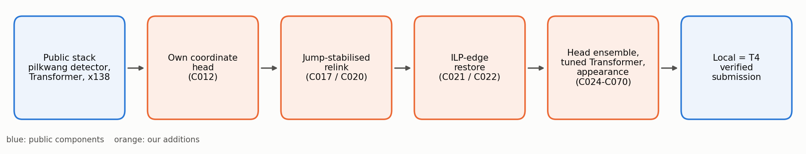

# Biohub Cell Tracking During Development — 팀 Taeyang

[English README](README.md)

Kaggle 대회 [Biohub - Cell Tracking During Development](https://www.kaggle.com/competitions/biohub-cell-tracking-during-development)(2026년 9월)의 전체 작업 기록입니다. 제브라피시 배아의 3D 타임랩스 영상에서 모든 세포핵을 찾고, 세포 분열을 포함해 시간 축으로 연결(lineage)하는 대회입니다.

| | 점수 | 순위 |
|---|---|---|
| 최종 Private | **0.918** | 515 / 4,017 |
| 최종 Public | 0.954 | 552 |
| 우리 제출 중 Private 최고 (C012, 최종 미선택) | 0.924 | 은메달권 |
| 1위 | 0.977 | 1 |

메달은 받지 못했습니다. 19일 동안 무엇을 만들었고, 후보 70개를 거치며 어떻게 발전했고, 왜 넘지 못했는지를 그대로 남기기 위해 저장소를 공개합니다. 상위 팀과의 비교는 [회고 문서](docs/POSTMORTEM.md)(영문)에 있습니다.


*학습 영상의 한 프레임. 왼쪽은 z축 최대 투영, 오른쪽은 C023 예측(초록, 세포핵 731개)과 주석된 정답(주황, 10개와 직전 8프레임 궤적)입니다. 세포핵의 약 2.8%에만 정답이 달려 있다는 점이 이 대회의 모든 것을 좌우했습니다.*

## 과제와 평가 방식

- 입력: 100프레임, 프레임당 64 x 256 x 256 복셀(1.625 x 0.406 x 0.406 um). 배아 4개에서 잘라낸 영상으로, 학습용 2개(`44b6`, `6bba`, 199편), Public용 1개(`fdad`), Private용 1개(`ea36`)입니다.
- 출력: 프레임마다 세포핵 하나당 노드 하나, 프레임 사이 연결은 엣지. 자식이 둘인 노드가 분열입니다.
- 점수: 노드 수 보정 엣지 Jaccard + 0.1 x 분열 Jaccard. 희소한 정답과 7um 반경으로 매칭합니다(학습 세트의 분열 주석은 151개).

## 기반으로 삼은 것과 우리가 더한 것



파란색은 공개 구성 요소, 주황색은 우리가 추가한 단계입니다. 검출기는 한 번도 재학습하지 않았습니다. 모든 채점 제출은 공개 temporal 3D U-Net과 node Transformer(pilkwang), x138의 후처리 체인(anvithpothula)을 그대로 쓰고 검출 이후 단계만 바꿨습니다. 단계별 설명은 [docs/ARCHITECTURE.md](docs/ARCHITECTURE.md), 출처는 [NOTICE.md](NOTICE.md)에 있습니다.

## 작업이 발전해 온 과정


| 날짜 (2026) | 단계 | Public | Private |
|---|---|---|---|
| 9/11-17 | 공개 0.947 노트북 재현, HOCT 기반 연결 연구(숨은 배아에서 실패) | 0.945-0.946 | 0.914-0.915 |
| 9/20 | C004: 공개 기준선 튜닝으로 0.947 동점대 돌파 | 0.948 | 0.915 |
| 9/23 | C012: x138로 이동, **자체 좌표 보정 head** | 0.952 | **0.924** |
| 9/24 | C020-C022: 프레임 점프 안정화 재연결 + ILP 엣지 복원 | 0.953 | 0.923-0.924 |
| 9/25 | C023: x138 공개 head, C024: 두 head 평균 | 0.954 | 0.917 / 0.923 |
| 9/26-29 | Transformer 미세조정, 외형 재연결, 분열 지도학습, 위치 보정 연구(C032-C070) | 0.953-0.954 | 0.917-0.923 |

단계별 서술은 [docs/JOURNEY.md](docs/JOURNEY.md), 후보별 아이디어·상태·점수·교훈은 [docs/EXPERIMENTS.md](docs/EXPERIMENTS.md)에 있습니다.

## 배운 것


1. **Public 동점 뒤에 Private 0.007 차이가 숨어 있었습니다.** x138 공개 head를 쓴 후보는 모두 Private 0.917-0.919, 자체 head 계열은 0.920-0.924였습니다. 최종 선택은 약한 쪽 계열에서 Public 0.954 동점 두 개를 골랐습니다.
2. **가장 큰 격차는 분열이었습니다.** 상위 팀은 전용 모델과 연결·분열 동시 최적화로 분열 항에서 0.03-0.05를 얻었습니다. 우리 분열은 기하 규칙에서 나왔고, 학습형 분열 스코어러는 하루 만에 닫았습니다.
3. **검증이 in-sample이었습니다.** 공개 검출기가 학습 영상 전부를 이미 학습한 상태라 로컬 이득이 낙관적으로 나왔고, 199편이 서로 겹치는 두 배아라는 사실은 막바지에야 발견했습니다.
4. **실행 자체는 문제가 아니었습니다.** C012 이후 제출이 실패하거나 로컬 결과와 달랐던 적은 없습니다. 약점은 무엇에 시간을 쓸지 고르는 판단이었습니다.

상위 팀 비교와 대회 중 놓친 토론 글의 힌트는 [docs/POSTMORTEM.md](docs/POSTMORTEM.md), 검증 문제는 [docs/VALIDATION.md](docs/VALIDATION.md)에 정리했습니다.

## 저장소 구성

```text
README.md, README.ko.md   개요 (영문 / 한국어)
docs/                     아키텍처, 진행 과정, 실험 카탈로그, 검증, 회고, 도구
  figures/                그림과 재생성 스크립트
  data/                   우리 제출 점수와 Private 리더보드 요약
experiments/
  candidates/cNNN_*/      후보별 폴더: 노트북, README, 리뷰, decision.json
  submission_log.csv      대회 중 기록한 제출 장부
src/                      로컬 추론, 후처리 재생 하네스, 채점 래퍼, 후보 빌더, 실험 드라이버
tools/                    공개 노트북 레이더, 3D 뷰어, 백그라운드 작업 알림
reports/                  공개 노트북·아이디어 검토 보고서, 재생 채점 요약
state/                    대회 중 작성한 연구 리뷰·감사·결정 기록
intel/                    논문·아이디어 메모
HANDOFF.md                세션 간 공유한 원본 연구 일지 (밀도가 높아 원문 그대로 둠)
PROJECT_STRUCTURE.md      원래 작업 폴더의 지도
```

대회 데이터, 모델 가중치, 실행 캐시와 로그, 타인의 노트북 원본은 포함하지 않았습니다. 스크립트는 원래 작업 폴더 구성을 전제로 하므로 실행 전에 [docs/TOOLING.md](docs/TOOLING.md)를 참고하세요.

## 라이선스

우리 코드와 문서는 Apache License 2.0([LICENSE](LICENSE))입니다. 후보 노트북은 Apache 2.0으로 공개된 Kaggle 노트북을 수정한 것이며, 원 저자는 [NOTICE.md](NOTICE.md)에 적었습니다.
