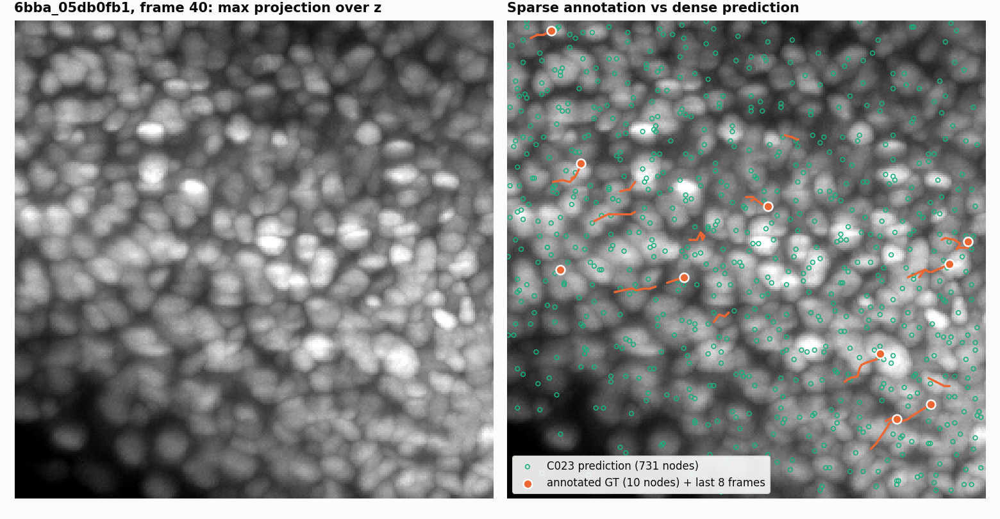
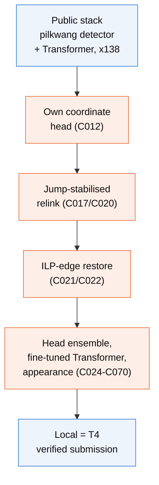
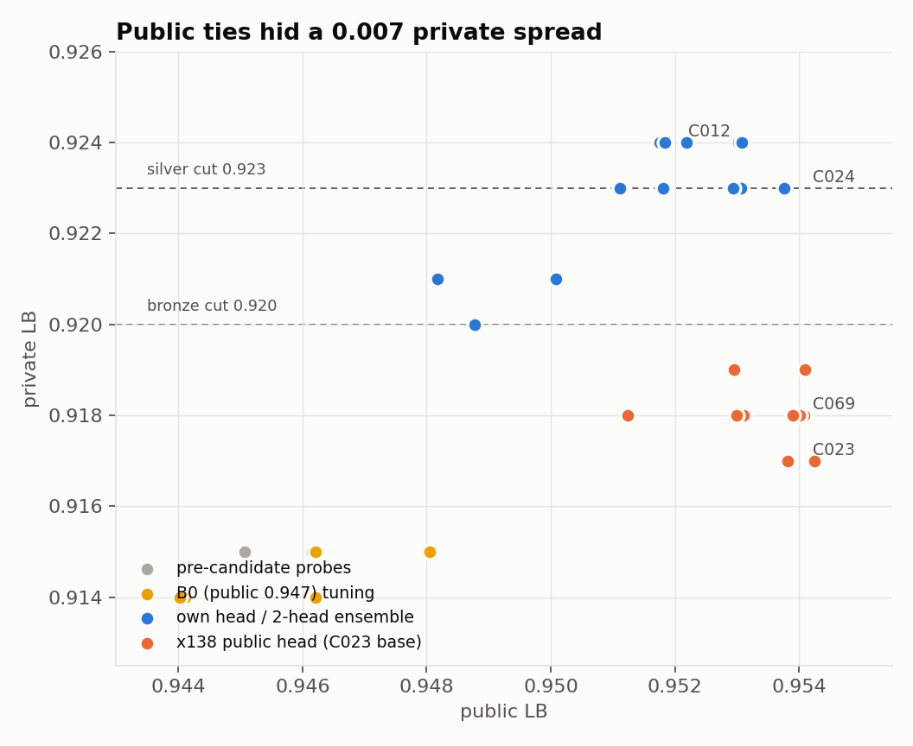

# Biohub Cell Tracking During Development — team Taeyang

[한국어 README](README.ko.md)

Our full working record for the Kaggle competition [Biohub - Cell Tracking During Development](https://www.kaggle.com/competitions/biohub-cell-tracking-during-development) (Sep 2026): detect every nucleus in 3D time-lapse movies of zebrafish embryos and link them into lineages, including cell divisions.

| | Score | Rank |
|---|---|---|
| Final private leaderboard | **0.918** | 515 / 4,017 |
| Final public leaderboard | 0.954 | 552 |
| Our best private submission (C012, not selected) | 0.924 | silver range |
| Winner | 0.977 | 1 |

We did not win a medal. This repository is kept public as an honest record of what we built in 19 days, how it evolved over 70 candidates, and why it fell short. The [postmortem](docs/POSTMORTEM.md) compares our work with the top solutions.



*One frame of a training movie. Left: maximum projection over z. Right: our C023 predictions (green, 731 nuclei) and the annotated ground truth (orange, 10 nuclei with their last 8 frames of track). Only about 2.8 % of nuclei are annotated, which shapes everything about this task.*

## The task and the metric

- Input: 100-frame movies of 64 x 256 x 256 voxels (1.625 x 0.406 x 0.406 um), crops of four embryos: two for training (`44b6`, `6bba`, 199 movies), one for the public leaderboard (`fdad`) and one for the private leaderboard (`ea36`).
- Output: a graph with one node per nucleus per frame and edges between frames; a node with two children is a division.
- Score: node-adjusted edge Jaccard + 0.1 x division Jaccard, matching within 7 um against sparse ground truth (151 annotated divisions in the training set).

## What we built on, and what we added



Blue: public components. Orange: our additions. We never retrained the detector. Every scored submission used the public temporal 3D U-Net and node Transformer (pilkwang) with the x138 post-processing chain (anvithpothula), and changed the stages after detection. Full stage-by-stage description: [docs/ARCHITECTURE.md](docs/ARCHITECTURE.md). Credits: [NOTICE.md](NOTICE.md).

## How the work evolved


| Date (2026) | Milestone | Public | Private |
|---|---|---|---|
| Sep 11-17 | reproduce the public 0.947 notebook, HOCT association research (failed on hidden embryos) | 0.945-0.946 | 0.914-0.915 |
| Sep 20 | C004: tuned public baseline breaks the 0.947 tie | 0.948 | 0.915 |
| Sep 23 | C012: move to x138 with **our own coordinate head** | 0.952 | **0.924** |
| Sep 24 | C020-C022: jump-stabilised relink + ILP-edge restore | 0.953 | 0.923-0.924 |
| Sep 25 | C023: x138's public head; C024: mean of both heads | 0.954 | 0.917 / 0.923 |
| Sep 26-29 | fine-tuned Transformers, appearance relink, division supervision, localisation studies (C032-C070) | 0.953-0.954 | 0.917-0.923 |

Narrative by phase: [docs/JOURNEY.md](docs/JOURNEY.md). Every candidate with its idea, status, scores and lesson: [docs/EXPERIMENTS.md](docs/EXPERIMENTS.md).

## What we learned



1. **Public ties hid a 0.007 private spread.** All candidates built on x138's public head scored 0.917-0.919 privately; those on our own head 0.920-0.924. We picked two public 0.954 ties from the weaker family.
2. **Divisions were the largest gap.** Top teams earned 0.03-0.05 from the division term with dedicated models and joint link/division optimisation; our divisions came from a geometric rule, and our learned division scorer was closed after one day.
3. **Validation was in-sample.** The public detector had been trained on every training movie, so local gains were optimistic, and we discovered only late that the 199 movies are two embryos with overlapping crops.
4. **Execution was not the problem.** No submission from C012 on failed or differed from its local run; the weak point was choosing what to work on.

Details, with the top-team comparison and the forum hints we under-used: [docs/POSTMORTEM.md](docs/POSTMORTEM.md) and [docs/VALIDATION.md](docs/VALIDATION.md).

## Repository layout

```text
README.md, README.ko.md   overview (English / Korean)
docs/                     architecture, journey, experiment catalogue, validation, postmortem, tooling
  figures/                figures and the script that regenerates them
  data/                   our scored submissions and the private leaderboard summary
experiments/
  candidates/cNNN_*/      one folder per candidate: notebook, README, reviews, decision.json
  submission_log.csv      submission ledger kept during the competition
src/                      local inference, replay harness, scorer wrapper, candidate builders, study drivers
tools/                    public-notebook radar, 3D viewer, background-job notifier
reports/                  written reviews of public notebooks and ideas
HANDOFF.md                raw research log shared between sessions (dense; kept as written)
PROJECT_STRUCTURE.md      map of the original working folder
```

Not included: competition data, model weights, run caches and logs, third-party notebook sources. The scripts expect those in the original workspace layout; see [docs/TOOLING.md](docs/TOOLING.md) before running anything.

## License

Our code and documents: Apache License 2.0 ([LICENSE](LICENSE)). Candidate notebooks are derived from public Kaggle notebooks under Apache 2.0; their authors are credited in [NOTICE.md](NOTICE.md).
