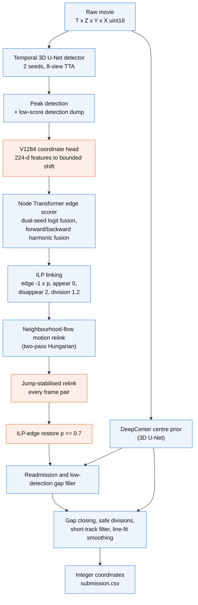
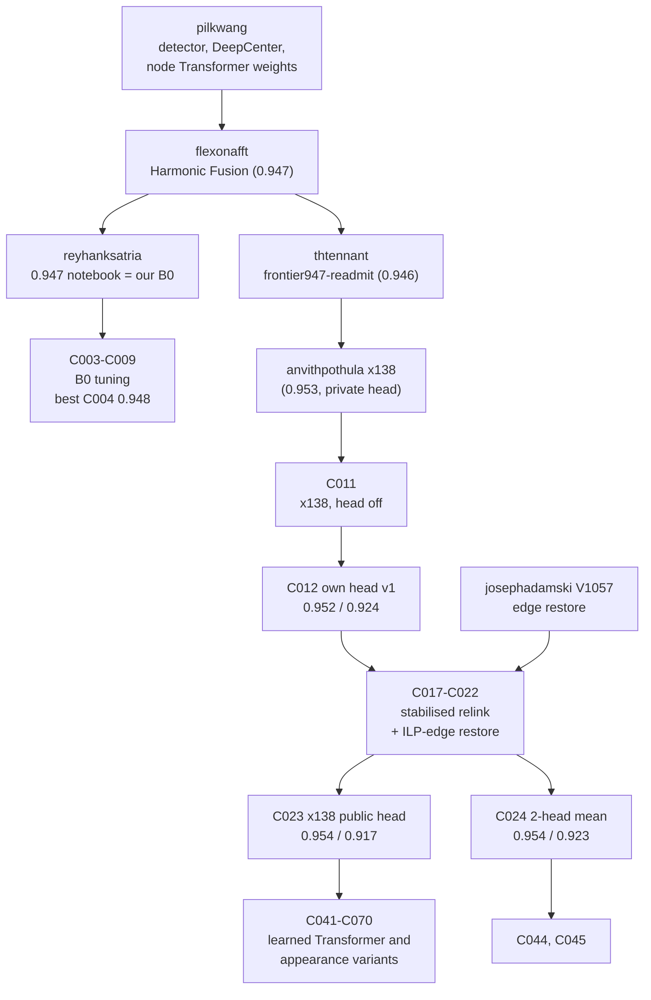
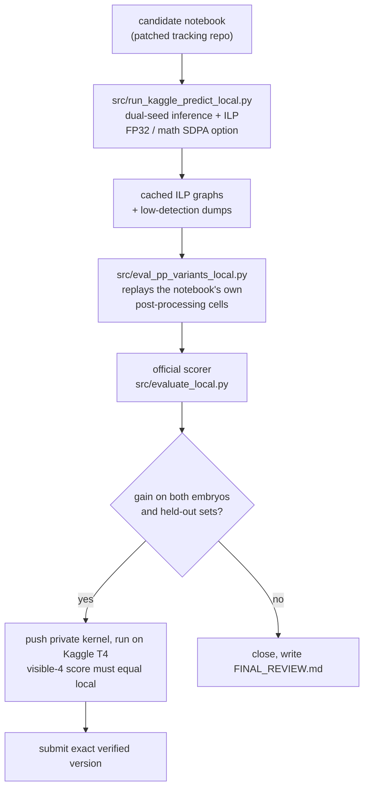

# Architecture

This page describes the inference pipeline that every scored candidate from C012 onward used, which parts came from public work, which parts we added, and where each part lives in this repository.

## The task in one paragraph

Each test movie is a 3D time-lapse of a zebrafish embryo crop: 100 frames of 64 x 256 x 256 voxels at 1.625 x 0.40625 x 0.40625 um. A submission is a graph: one node per nucleus per frame (`t, z, y, x`) and one edge per frame-to-frame link; a node with two children is a division. The score is

```
score = node-adjusted edge Jaccard + 0.1 x division Jaccard      (maximum 1.1)
```

Matching uses a 7 um radius against sparse ground truth: only about 2.8 % of nuclei are annotated, and the training set holds 151 annotated divisions across 199 movies from two embryos (`44b6`, `6bba`). The public leaderboard used a third embryo (`fdad`), the private leaderboard a fourth (`ea36`).

## Pipeline



Blue boxes are public components (models and post-processing from the notebooks listed in [Lineage](#lineage)). Orange boxes are the stages where our own work changed the scored output: our own coordinate head (C012, and the two-head ensemble in C024), the every-pair jump-stabilised relink (C017/C020) and the ILP-edge restore stage we ported from a public notebook (C021/C022). Later candidates (C041-C070) replaced the node Transformer weights or added an appearance term to the relink; the stage layout stayed the same.

## Stage by stage

| Stage | What it does | Origin | Where in this repo |
|---|---|---|---|
| Detection | Temporal 3D U-Net (two input frames, output downsampled (1, 4, 4)); two seeds; 8 flip views averaged | public weights (pilkwang support pack), not retrained by us | used through the candidate notebooks |
| DeepCenter | 3D U-Net centre prior; vetoes gap fills and divisions where no centre is seen | public | same |
| Coordinate head ("V1284") | `Linear(224, 32) -> SiLU -> Linear(32, 3)` on the detector's 32-channel features at a peak and its 6 neighbours; output bounded to 2 um | slot from x138; **head v1 trained by us** on 30 captured movies; x138's public head; mean of both in C024 | `src/v1284_capture_local.py`, `src/v1284_head_train.py`, `src/build_head_ensemble.py` |
| Edge scorer | Node Transformer over candidate pairs; two seeds fused; forward and reverse-time probabilities fused harmonically | public; **fine-tuned variants by us** in C037/C041/C052/C065/C067 | `src/c037_transformer_study.py`, `src/c041_fixed_models.py`, `src/c052_division_transformer.py` |
| ILP | Chooses edges with SCIP: reward `-1 x p` per edge, appear 0, disappear 2, division 1.2 | public | notebook cell |
| Motion relink | Replaces the ILP edge set by a two-pass Hungarian assignment under a neighbourhood-flow motion prior | public (x138) | notebook cell |
| Jump-stabilised relink | Removes whole-field jumps between frames (median displacement of ILP links) before the relink; applied to every frame pair | **ours** (C017, C020) | `src/build_c017_candidate.py`, `src/frame_motion_audit.py` |
| ILP-edge restore | Puts back ILP edges with p >= 0.7 that the Hungarian relink displaced | ported from josephadamski's V1057 notebook (C021, C022) | `src/build_c021_candidate.py` |
| Readmission, gap filler | Re-admits discarded detections near open track ends; fills 1-3 frame gaps with sub-threshold peaks | public (x138) | notebook cell |
| Safe divisions | Geometric graft: a parent with one child gets a second daughter if distances, symmetry and DeepCenter agree | public | notebook cell; learned alternative studied in `src/division_scorer_stage.py` (closed) |
| Clean-up | Short-track filter, 5-frame line-fit smoothing, integer coordinates | public | notebook cell |
| Appearance term | Fixed CNN embedding cosine added to the relink cost (C041 onward) | **ours** | `src/c038_complementary_stage.py`, `src/c041_fixed_models.py` |

One structural property matters for the later analysis: with division cost 1.2 against appearance 0, the ILP almost never forms a fork, and the Hungarian relink is one-to-one. Every division in the output therefore comes from the geometric safe-division graft. The division term (worth up to 0.1) was decided by a hand-written rule, which is the main gap to the top teams described in [POSTMORTEM.md](POSTMORTEM.md).

## Lineage



Scores are public / private. The public detector, DeepCenter and Transformer weights were trained on all 199 training movies, which is why every local score in this project was in-sample for the detector (see [VALIDATION.md](VALIDATION.md)).

## Local reproduction of the Kaggle run

The Kaggle notebooks were too slow to iterate on (6-10 hours per scored run, 5 shared submissions per day), so most measurements ran locally on an RTX 4070 Ti SUPER:



The local run reproduced the T4 run closely (visible-4 official score 0.9056 locally and on T4; 99.97 % identical detections; median edge-probability difference 3e-5). Every submission from C012 onward was pushed only after the T4 visible-4 score matched the local prediction.
