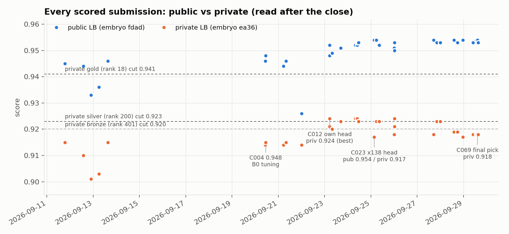
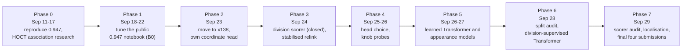

# Journey: how the work evolved

The team entered late. Our first scored submission was on 2026-09-11 and the competition closed on 2026-09-29 23:59 UTC, so everything here happened in 19 days. Dates are UTC unless marked KST.

Blue dots are public scores (embryo `fdad`, visible during the competition); orange dots are private scores of the same submissions (embryo `ea36`, read after the close). Dashed lines are the private medal cut-offs.

## Phases at a glance

## Phase 0 (Sep 11-17): reproducing the public baseline

- The public frontier was a family of notebooks at 0.947 built on pilkwang's detector and node Transformer, with Harmonic Fusion post-processing (flexonafft). Our own reconstruction scored 0.946.
- We spent the first week on an alternative association model: features from the host's HOCT tracker normalised into a target-parent ranker ("R3"). It looked good on the visible movies (official proxy 0.9054-0.9062) but scored 0.933 and 0.936 on the leaderboard. This was the first warning that visible-movie gains do not transfer. Notes: [`reports/research_20260913/research_plan.md`](../reports/research_20260913/research_plan.md).
- On 2026-09-17 we cleaned up the workspace and fixed the exact public 0.947 notebook (reyhanksatria) as the immutable baseline **B0**. The missing 0.001 in our reconstruction turned out to be its disabled in-notebook validator.

## Phase 1 (Sep 18-22): tuning B0

- C003-C009 changed division geometry, short-track rescue, velocity weighting and gap stitching on B0.
- C004 scored 0.948 and broke the 689-team tie at 0.947. We later found that the notebook's validator had rejected the intended wide division envelope and submitted a stricter configuration, so the "proven" settings were not what scored.
- C005-C007 (0.944-0.946) regressed; C008 (0.926) added our own locally trained U-Net weights, which had a feature-scale mismatch with the public pipeline.
- Lesson recorded at the time: settings that look good on full ground-truth graphs or on the visible movies did not survive real predictions on hidden embryos.

## Phase 2 (Sep 23): x138 and our own coordinate head

- The best public notebook was now anvithpothula's x138 (0.953), which depended on a private "V1284" coordinate head that refines detection centres. Without the head (C011) it was identical to a public 0.946 notebook, so the head was worth about +0.007.
- We captured the detector features used by the head, matched them to ground truth and trained our own head. **C012 scored 0.952 public and 0.924 private, our best private score of the competition.**
- Variants: half-strength (C013, 0.948), a head trained on more movies (C014, 0.949) and readmission off (C015, 0.951) were all worse on the public board.

## Phase 3 (Sep 24): divisions, node budget, stabilised relink

- A learned division scorer (C016) replaced nothing: its precision on held-out movies was 6-12.5 %, below the 15 % break-even, and it was closed the same day. A node-budget idea and ILP division-weight changes were also measured and closed.
- `src/frame_motion_audit.py` found frozen frames and whole-field jumps in the movies. Removing the jump before the motion relink (C017, every frame pair in C020) and restoring ILP edges that the relink had displaced (C021/C022, ported from a public V1057 notebook) gave **0.953 public**.

## Phase 4 (Sep 25-26): head choice and knob probes

- C023 swapped in x138's public head on the C022 base and reached **0.954 public**; C024 averaged our head and x138's head and also reached 0.954.
- Readmission, gap-closing and smoothing knobs that improved all local groups (C025, C028, C029) lost 0.001-0.004 on the public board.
- C023 and C024 became the recommended final picks. The private board later showed C023 at 0.917 and C024 at 0.923.

## Phase 5 (Sep 26-27): learned components on a frozen detector

- Temporal context in the detector (C032), a public structured-assignment model (C033), appearance re-identification (C034, C035) and local image registration (C036) were tested and closed.
- Fine-tuning only the node Transformer on known links (C037) and adding a fixed appearance term to the relink (C038-C041) gave small consistent local gains. C042/C043 and C044/C045 were packaged with exact local/T4 parity checks and submitted (0.953-0.954 public).

## Phase 6 (Sep 28): split audit and division-supervised Transformer

- A pixel audit showed that "different" movies overlap, and that the 199 movies are only two embryos. From C048 on, every learned component was trained on one embryo and evaluated on the other.
- C052 trained the Transformer with division links as extra supervision on whole-embryo folds; C053 (parameter mean) and C054 (output mean) were submitted at 0.954 / 0.953 public.

## Phase 7 (Sep 29): scorer audit, localisation studies and the final four

- We discovered that our historical "official" columns came from a replica scorer and re-scored 388 saved graphs with the organisers' code.
- An error budget showed that 75.6 % of missed links touched a node more than 3.5 um from ground truth. Four localisation models (C058, C060, C061, C063) and a DeepCenter axial probe (C064) all failed their gates.
- In the last day, four final candidates (C065, C067, C069, C070: pooled and single-embryo Transformers with and without the appearance term) were verified on T4 and submitted. All four scored 0.953-0.954 public and 0.918 private.

## Result

Final private score **0.918, rank 515 of 4,017** (public 0.954, rank 552). Our own best private submission was 0.924 (C012, also C017/C018/C020/C027); choosing any of the own-head family as a final pick would have placed in the silver range. The review of why, and what the top teams did differently, is in [POSTMORTEM.md](POSTMORTEM.md).
