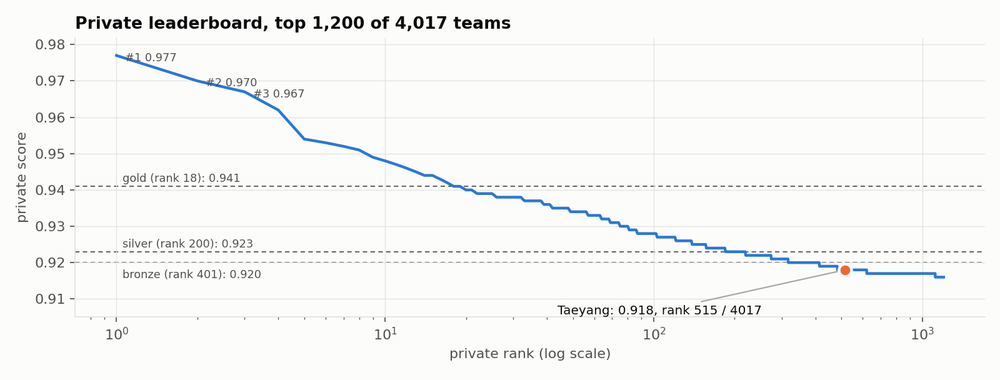

# Postmortem

Written on 2026-09-30, after the private leaderboard was published. It compares our work with the solution write-ups of the top teams and with what was already public in the forum before the close.

## 1. Outcome

| | Score | Rank |
|---|---|---|
| Our final (private) | **0.918** | 515 / 4,017 |
| Our final (public) | 0.954 | 552 |
| Our best private submission (C012, C017, C018, C020, C027) | 0.924 | would have been about 157-184 |
| C024, one of the two recommended picks | 0.923 | about 185-219 |
| Private medal cut-offs | bronze 0.920 (rank 401), silver 0.923 (rank 200), gold 0.941 (rank 18) | |
| Top 3 | 0.977, 0.970, 0.967 | |

Two separate gaps:

1. **About 0.005 to a medal was lost in final selection.** Every pick was a public 0.954 tie from the x138-head family, which scored 0.917-0.919 privately. One pick from the own-head family would have landed at 0.923-0.924.
2. **About 0.02-0.05 to the gold zone was a difference in approach**, explained below.

## 2. What the top teams did

| Team (private) | Base | What made the difference |
|---|---|---|
| [3rd, yu4u (0.967)](https://www.kaggle.com/competitions/biohub-cell-tracking-during-development/writeups/3rd-place-solution) | own models | 2.5D U-Nets with ImageNet-pretrained encoders plus a 3D SegResNet, 5-fold; unannotated cells masked out of the loss; dense 3D flow; a learned matcher; three division models fed motion-aligned frames; one LP/MILP that chooses links and divisions jointly with a surrogate of the metric; gap closing and affine coordinate refinement. All tuning on out-of-fold predictions. |
| [12th, Corwin (0.946)](https://www.kaggle.com/competitions/biohub-cell-tracking-during-development/writeups/12th-place-solution) | the **same public models we used**, not retrained | Division consolidation and a fork certifier, a mitosis specialist (CNN pretrained on external data + boosters + DINOv2, 8 forks fired on 4 movies), a final repair block, a learned recentring CNN trained on 930k node samples. 112 submissions over 52 days, most of them single-variable reads. |
| [14th, Vibes & Edges (0.944)](https://www.kaggle.com/competitions/biohub-cell-tracking-during-development/writeups/14th-place-solution-from-vibes-and-edges-trade-off) | own models | Flow-field segmentation of touching nuclei; divisions found by regressing each daughter voxel's displacement to its parent and testing convergence plus separation. |
| [18th, ymg_aq (0.941)](https://www.kaggle.com/competitions/biohub-cell-tracking-during-development/writeups/18th-place-solution-lineage-graph-refinement) | public Harmonic Fusion detection | Everything after detection rebuilt: 341-feature LightGBM edge model, per-frame matching, CatBoost + external-data CNN + TabPFN division stack, whole-embryo CV on all 199 movies. |
| [89th, tkatsuma (0.928)](https://www.kaggle.com/competitions/biohub-cell-tracking-during-development/writeups/89th-place-division-reselection-transferred-to-pr) | public readmit chassis (same family as ours) | Coordinate head (+0.007 public and private) and a logistic-regression division reselection over orphan daughters (+0.008 private). |
| [hjyact (0.939, not selected)](https://www.kaggle.com/competitions/biohub-cell-tracking-during-development/writeups/from-scratch-2-5d-convnext-detector-ilp-tracker) | own ConvNeXt-nano 2.5D detector | Judged every change on the other embryo with the official scorer; private went up, not down. |

The pattern: the closer a team stayed to the public stack, the more its gain came from **divisions** and **coordinates**; the teams above 0.96 privately rebuilt **detection** and the **link/division optimisation**.

## 3. Where our approach differed, stage by stage

| Stage | Top teams | Us | Size of the gap |
|---|---|---|---|
| Reading the metric | Split the lost score into terms. 12th: divisions were 51 % of their loss; one division = about 74 edges. | Counted TP/FP/FN per experiment but never built the loss table first. | Decided where time went |
| Detection | Own detectors (3rd, 14th, hjyact) with sparse-label-aware losses | Public detector frozen throughout; we measured 101 of 213 missed GT nodes as "never detected" but had no tool to fix it | Large |
| Coordinates | Learned recentring with guards (12th, +0.003 private); affine refinement (3rd, +0.006 CV) | Own head v1 (our best private); C058-C064 localisation models all failed on the opposite embryo | Medium |
| Linking | 18th replaced edge probabilities (+0.021 CV); 3rd's matcher alone added little | Transformer fine-tunes, +0.001-0.002 private | Small, and where our last week went |
| Divisions | Dedicated models, joint optimisation, conservative selection | Geometric rule from the public notebook; learned scorer closed after one day | **Largest** (term worth 0.03-0.05 to them) |
| Validation | OOF predictions (3rd); whole-embryo CV (18th, hjyact); leaderboard as a single-variable instrument (12th) | In-sample 97 movies, replica scorer until the last day | Affected every decision |
| Final selection | 89th: "keep one final slot for a different chassis" | Two public ties from one family | The medal |

## 4. Case study: why our division scorer failed where theirs worked

On 2026-09-24 we built a learned division scorer (C016) of the same kind that later earned 89th place +0.008 private. Our break-even calculation was correct: adding a fork that is right with probability p helps when p > J/(1+J), about 0.15 for our division Jaccard. The scorer was genuinely below it: 6-12.5 % precision on held-out movies across model variants. The differences were in the problem set-up:

1. **Candidate pool.** We let the second daughter be any nucleus within 14 um, including ones already linked to another parent, because most missed divisions looked like that. This made positives 0.05 % of candidates (68-85 against about 148,000). 89th used orphan daughters only (31 positives in 157 candidates); 12th fired 8 forks out of 19,733 candidates. They gave up recall to make precision reachable.
2. **No image evidence.** Our features were geometry and intensity statistics in a small MLP. 12th's geometric booster alone reached 32 % precision at their operating point; adding an externally pretrained division CNN and DINOv2 raised it to 85 %.
3. **The conservative version was rejected as noise.** Our own top-20 analysis showed 45 % precision but an expected gain of about +0.0002 public, and we required +0.01 local before submitting anything. 12th shipped exactly this kind of small stage and got +0.003 private.
4. **We never tried removing false forks.** Our diagnosis showed only 5 of 13 forks on annotated parents were correct. 12th's learned fork-cut rule earned +0.005 private.
5. **Time.** The study ran for about ten hours (2026-09-24 02:40-12:10 KST) before it was closed.

Two caveats. Our precision numbers were themselves in-sample for the detector, so the test-time precision would have been lower still. And other forum reports (a trained division head that moved the leaderboard by ±0.001) pointed the same way as our result. The lesson is not that the decision was miscalculated, but that the problem was framed too broadly and too briefly.

## 5. Hints that were public before the close

Most of what the top teams did was signposted in the competition forum, often by people who finished near the top. Dates are approximate.

| When | Thread | Hint | How we used it |
|---|---|---|---|
| late Jun | [Temporal affinity fields](https://www.kaggle.com/competitions/biohub-cell-tracking-during-development/discussion/723655) | Predict a vector field for linking; the 14th-place author replied that they were starting a flow approach. | Not acted on. |
| late Jul | [Does CV match LB?](https://www.kaggle.com/competitions/biohub-cell-tracking-during-development/discussion/730160) | Public weights trained on all 199 movies; post-processing ablations flip sign on the LB; use leave-one-embryo-out. | Known, cited in our notes on 09-24; we raised the bar instead of fixing validation. |
| late Jul | [A one-to-one linker scores 0.000 on divisions](https://www.kaggle.com/competitions/biohub-cell-tracking-during-development/discussion/733877) | The division term is the largest block most baselines leave behind. | Read; division work started on 09-24 and stopped the same day. |
| Jul-Aug | [What is the best model for this domain?](https://www.kaggle.com/competitions/biohub-cell-tracking-during-development/discussion/734604) | The eventual 5th-place finisher: retrain instead of using the public checkpoint; work order detection, then linking, then division. Another reply: decompose the score before switching models. | Cited; detector never retrained. |
| Aug | [What layer did your gains come from?](https://www.kaggle.com/competitions/biohub-cell-tracking-during-development/discussion/737543) | A 21st-place team member reported division Jaccard 0.28 on the LB and that divisions need about 3 um accuracy. | Cited; our division Jaccard (about 0.14-0.18) was never compared with it. |
| Aug | [Detector overfits past epoch 10](https://www.kaggle.com/competitions/biohub-cell-tracking-during-development/discussion/738773) | Unlabelled nuclei turn into negative targets; the fix is the loss mask 3rd place used. | Not acted on (no detector training). |
| Sep 15 | [External zebrafish data](https://www.kaggle.com/competitions/biohub-cell-tracking-during-development/discussion/741386) | The eventual 1st-place finisher: the public Ultrack embryo has the same spacing and can be cropped for use. | Listed as untried. |
| Sep 17 | [Model changes don't move the LB](https://www.kaggle.com/competitions/biohub-cell-tracking-during-development/discussion/741749) | Synthetic-data pretraining was the only big lever (+0.012-0.018); a trained division head moved the LB ±0.001. | We used the second half as a reason to close learned components. |
| Sep 19-25 | [Public weights are in-sample](https://www.kaggle.com/competitions/biohub-cell-tracking-during-development/discussion/742064), [Eight LB experiments](https://www.kaggle.com/competitions/biohub-cell-tracking-during-development/discussion/743222) | Stop tuning inference; train on one embryo and evaluate on the other. | Applied from 09-28 to newly fitted components only. |
| Sep 28 | [Public 0.953 to 0.959 in two days](https://www.kaggle.com/competitions/biohub-cell-tracking-during-development/discussion/743929) | Reply from the eventual 6th-place finisher: knob tuning of the 0.953 stack is overfitting, a shake-up is coming. | Not seen in time. |

Our notes from 2026-09-24 cite several of these threads, so they were read. The difference was interpretation: reports that learned components did not move the leaderboard were taken as "learned components do not transfer", where the authors themselves concluded "the validation is broken, fix it first".

## 6. Lessons

1. **Decompose the score before choosing work.** A half-day table of lost score per term would have pointed at divisions on day one.
2. **Make validation honest before making it strict.** Out-of-fold upstream predictions and whole-embryo folds beat a higher acceptance threshold on in-sample numbers.
3. **Frame rare-event problems for precision.** Narrow the candidate set until the needed precision is reachable, add image evidence, and accept small recall.
4. **Let small verified gains accumulate.** Stages worth +0.001-0.003 each made up most of 12th place's lead over the public stack.
5. **Treat public ties as noise.** A 0.001 public difference was within read noise (about ±0.002-0.003); final picks should come from different families.
6. **Re-read closed decisions.** Handoff notes recorded conclusions such as "division lane closed"; later sessions inherited them as facts without re-checking the reasoning.
7. **Start early enough for the big moves.** Detector retraining or a new optimiser needs several weeks; with 19 days the work stayed inside the public stack.

## 7. Playbook for working with coding agents next time

Most of this project was run by AI coding agents with a persistent handoff file. They were good at execution: exact local/T4 parity, hash-pinned inputs, background queues, no duplicate submissions. They were weak at strategy: they optimised what was easy to verify and rarely questioned the frame. Prompts that would have helped:

- *Before any modelling:* "Reproduce the official scorer and split our baseline's lost score by term. For each term, compute the score value of fixing one error."
- *Before choosing a direction:* "The top public score is X and ours is Y. List 3-5 hypotheses for where the gap comes from, with time, GPU cost and expected gain for each, and evidence from similar past competitions."
- *When an agent closes a direction:* "Show the closing criterion as a derivation. Is this 'no effect' or 'not measurable with our sample size'?"
- *Weekly:* "List every closed direction and its evidence. Which assumptions have since turned out false? Is the current work large enough relative to the remaining gap?"
- *Before final selection:* "Group candidates by structural family and recommend one from each. Do not rank by public score."
