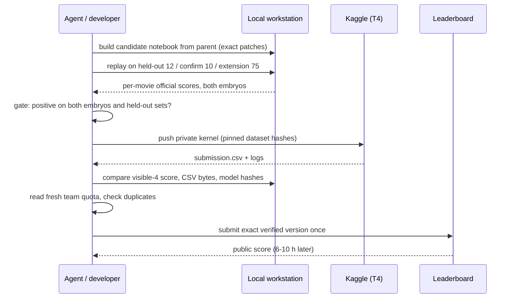

# Tooling and workflow

This repository is a research log, not a packaged library. The scripts ran on one Windows workstation (RTX 4070 Ti SUPER, global Python 3.12 with PyTorch, `tracksdata`, `pyscipopt`, `zarr`) next to competition data, model weights and run caches that are not published here. Paths such as `data/train`, `artifacts/` and `tmp/c0NN_output/` refer to that workspace. Read the code to see how a result was produced; expect to adapt paths before running anything.

## Main tools

| Tool | Purpose |
|---|---|
| [`src/run_kaggle_predict_local.py`](../src/run_kaggle_predict_local.py) | Runs a candidate notebook's patched tracking repo locally: dual-seed inference + ILP on training movies, writing ILP graphs and low-detection dumps. `--v1284-mode`, `--v1284-head "a.pt;b.pt"` (head ensemble), `--env KEY=VALUE` (override a notebook setting), `--t4-fp32` (disable TF32 and flash attention to stay close to the T4 run). |
| [`src/eval_pp_variants_local.py`](../src/eval_pp_variants_local.py) | Replays a notebook's own post-processing cells on cached ILP graphs and scores variants. Calibrated to reproduce C004's in-notebook validator table exactly. Options for every post-processing stage we added (`--stabilize-relink`, `--ilp-edge-restore`, `--round-coords`, ...). |
| [`src/evaluate_local.py`](../src/evaluate_local.py) | Scores a `submission.csv` or a folder of GEFF graphs with the organisers' metric code ([royerlab/kaggle-cell-tracking-competition](https://github.com/royerlab/kaggle-cell-tracking-competition), pinned to commit `075fc5f5`). |
| [`src/v1284_capture_local.py`](../src/v1284_capture_local.py), [`src/v1284_head_train.py`](../src/v1284_head_train.py) | Capture the detector's 224-d features at each detection, match to ground truth, train an x138-compatible coordinate head. |
| `src/build_c0NN_candidate.py`, `src/build_head_ensemble.py`, `src/build_env_variant_candidate.py` | Build a candidate notebook from its parent by exact text patches; every builder compile-checks all cells. |
| `src/verify_c0NN.py` | Check a built notebook: text diff against the parent and, with `--replay`, equality between the notebook's output and the harness. |
| `src/cNNN_*.py` (C032 onward) | Study drivers with `prepare / run / analyse` sub-commands. `prepare` writes a plan with SHA-256 hashes of every input; `run` executes finite jobs through a resumable queue (`src/run_last_days_local.py`); `analyse` writes `FINAL_REVIEW.md` / `decision.json`. |
| [`src/frame_motion_audit.py`](../src/frame_motion_audit.py) | Finds frozen frames and whole-field jumps in movies (basis of the stabilised relink). |
| [`src/diagnose_divisions_local.py`](../src/diagnose_divisions_local.py), [`src/audit_official_error_budget.py`](../src/audit_official_error_budget.py) | Why divisions and links are missed: detection miss, no fork, wrong partner, localisation error. |
| [`src/final_four_verify.py`](../src/final_four_verify.py), [`src/final_four_submit.py`](../src/final_four_submit.py) | Last-day submission path: fetch the exact Kaggle kernel output, verify source/model/CSV hashes and the visible-4 score against the local run, read the fresh team quota, refuse duplicates, submit once and record the accepted ID. |
| [`tools/notebook_radar/`](../tools/notebook_radar/) | Collector and local dashboard for public Kaggle notebooks: listings, live scores, category tags, pulled sources (`python tools/notebook_radar/notebook_radar.py crawl|status|serve`). Reads the Kaggle token from the environment or the Kaggle CLI config. |
| [`tools/BiohubViewer/`](../tools/BiohubViewer/) | PyQt viewer for `.zarr` movies with GEFF node and track overlays (build with `build.ps1`; the binary is not in this repo). |
| [`tools/notify_background_completion.ps1`](../tools/notify_background_completion.ps1) | Windows toast when a background job finishes or its process dies. |

## How a change became a submission

The verification side of this worked well: from C012 on, no submission failed or differed from its local run. The weak side was the gate: it relied on in-sample local scores (see [VALIDATION.md](VALIDATION.md)).

## Working with AI coding agents

Most of the implementation and many of the experiments were run by AI coding agents (mainly OpenAI Codex and Claude Code) under the team's direction. Two files carried state between sessions:

- [`HANDOFF.md`](../HANDOFF.md): the research log and source of truth for decisions, numbered by section. It is published as-is; the top of the file reflects the final days and is dense.
- `AGENTS.md` (not published): operating rules for the agents, such as "reuse the replay harness, do not write another scorer", submission authorisations, and running status notes.

Rules that held up: one change per candidate, exact hashes for every input and output, local/T4 equality before any submission, no score polling, no resubmission after an uncertain result. Rules that did not: an acceptance bar of +0.005 local on in-sample movies, and treating "closed" entries in the handoff as settled facts. See [POSTMORTEM.md](POSTMORTEM.md), section 7.
